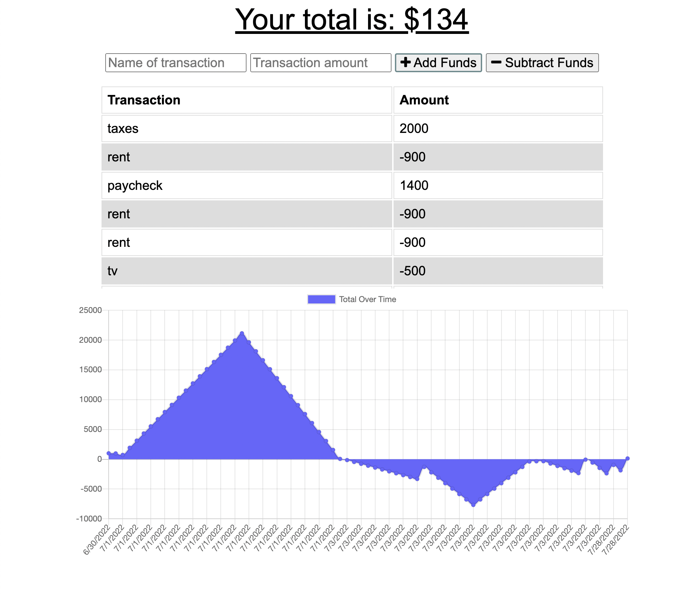

# Budget Tracker 

## Purpose
Giving users a fast and easy way to track their money and allowing them to access that information at any time. Having offline functionality is paramount to the success of an application that handles users’ financial information.

## Table Of Contents
* [General_info](#story)
* [Technologies](#built-with)
* [Screenshot](#screenshot)

## Story
As an avid traveler I want to be able to track my withdrawals and deposits with or without a data/internet connection so that my account balance is accurate when I am traveling 

## Built With
* Visual Studio Code
* Express
* JavaScript
* MongoDB
* Mongoose
* Progressive Web Application

## Screenshot 

